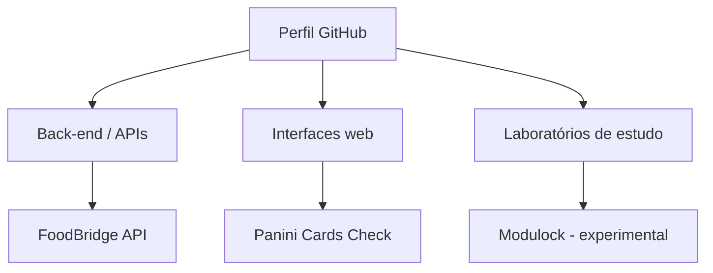

# Organização do portfólio

```mermaid
flowchart TD
  Perfil["Perfil GitHub"] --> Backend["Back-end / APIs"]
  Perfil --> Web["Interfaces web"]
  Perfil --> Labs["Laboratórios de estudo"]
  Backend --> FoodBridge["FoodBridge API"]
  Web --> Panini["Panini Cards Check"]
  Labs --> Modulock["Modulock - experimental"]
```

Este é um **mapa de projetos independentes**, não um diagrama de serviços integrados entre si.
